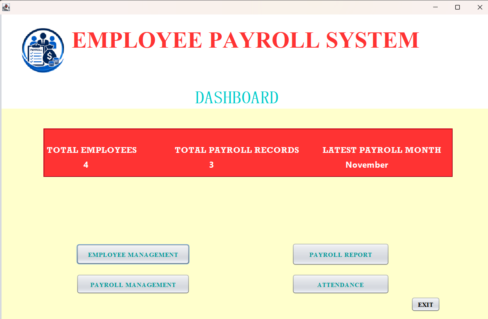
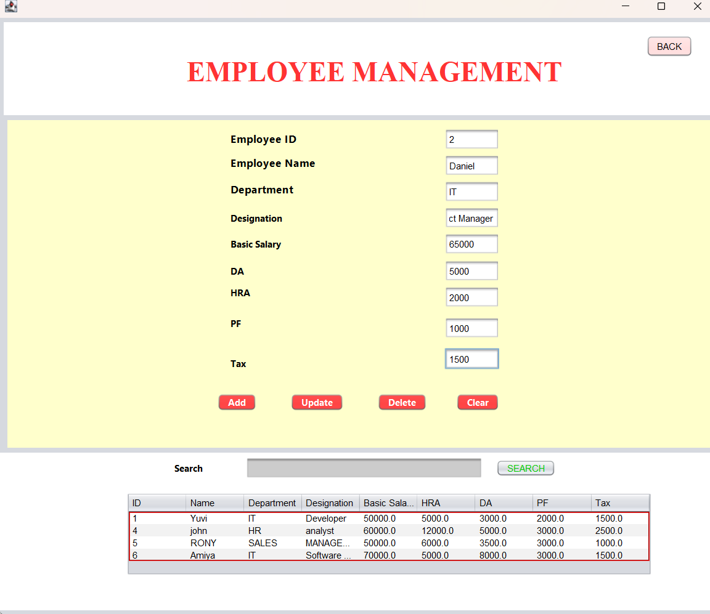
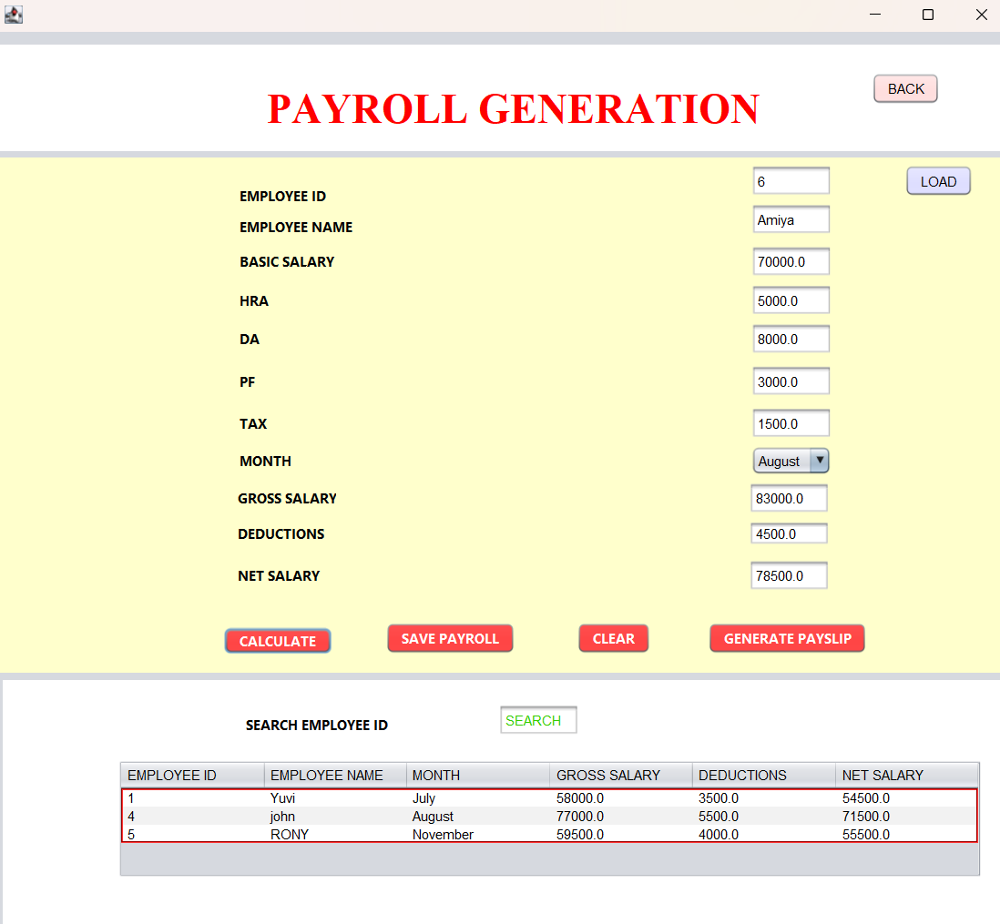
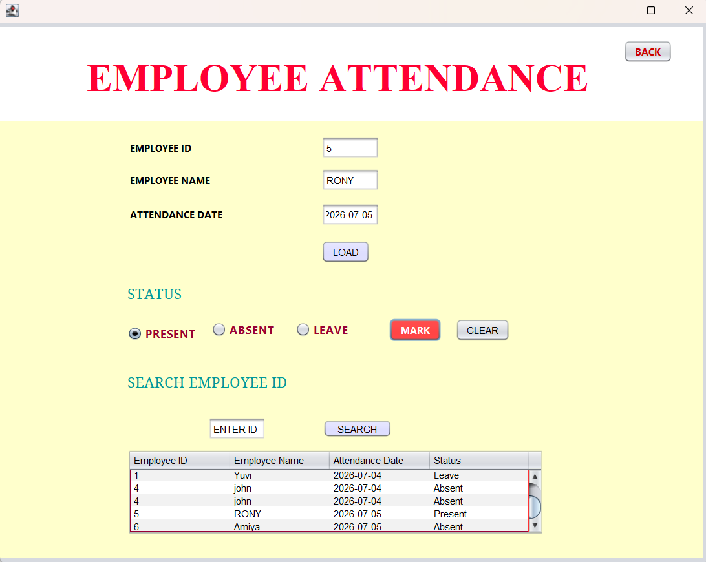
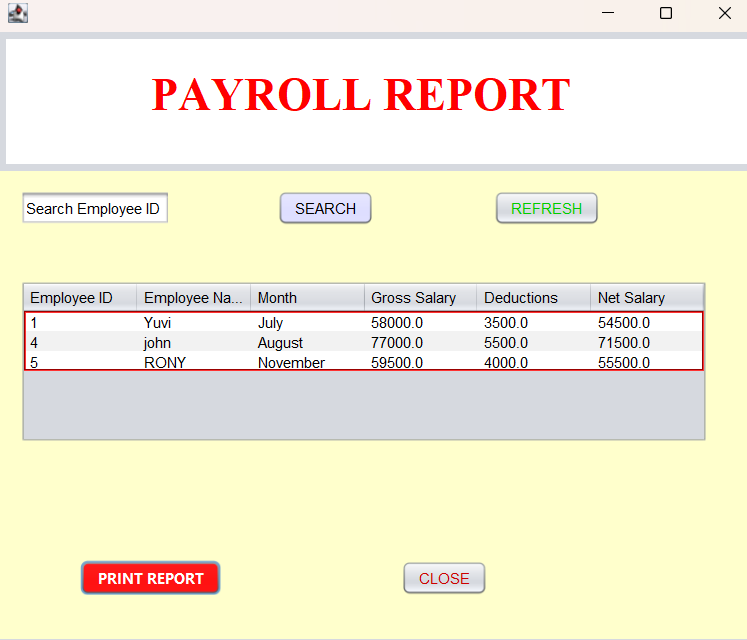

# Employee Payroll Management System

A desktop application developed using Java Swing and MySQL.

## Features
- Employee Management
- Payroll Generation
- Payroll Reports
- Employee Attendance
- Dashboard
- Search Employees
- Duplicate Attendance Prevention
- Delete Payroll Records

## Technologies Used
- Java
- Java Swing
- JDBC
- MySQL
- NetBeans IDE

## Database
MySQL
## Screenshots

### Dashboard

### Employee Management

### Payroll Management

### Attendance Management

### Payroll Report

## Author
Yuvi Shyju
